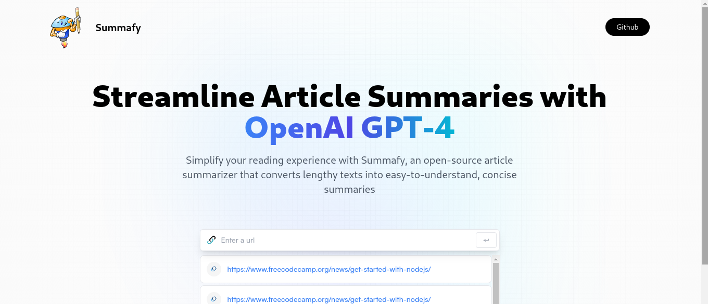

# Summafy

An AI-powered web application that allows users to quickly summarize web articles by simply pasting the URL. The application utilizes the OpenAI GPT-4 model through RapidAPI to generate concise and accurate summaries.  



## Features  
- **AI-Powered Summarization**: Leverages GPT-4 via RapidAPI for quick and intelligent article summarization.  
- **URL Input**: Paste any article URL to get a summary.  
- **Save History**: Automatically saves article URLs and their summaries in local storage for easy access.  
- **Copy to Clipboard**: Allows copying of article URLs with a single click.  
- **Error Handling**: Graceful error handling for invalid inputs or API failures.  
- **Responsive UI**: Built with Tailwind CSS for a clean, responsive design.  

## Tech Stack  
- **Frontend**: React.js with Vite for fast development and optimized builds.  
- **State Management**: Redux Toolkit for managing application state.  
- **Styling**: Tailwind CSS for modern and responsive UI components.  
- **API**: OpenAI GPT-4 model via RapidAPI for article summarization.  
- **Local Storage**: Saves and persists user data for summaries and browsing history.  

### Installation  
1. Clone this repository:  
   ```bash  
   git clone https://github.com/MuxN4/summafy.git 

   cd ai-article-summarizer  

2. Install dependencies:
    ```bash
    npm install  
    # or  
    yarn install  

3. Set up environment variables:
Create a .env file in the root directory and add your RapidAPI key:

    ```plaintext
    VITE_RAPIDAPI_KEY=your_rapidapi_key_here  

4. Start the development server:
    ```bash
    npm run dev  
    # or  
    yarn dev  

## Usage
- Enter the URL of an article into the input field.
- Submit the form to generate a summary.
- View, copy the summary.


## License
This project is open-source and available under the MIT License.

